# HotBox

HotBox - a tiny enclosure heater

## Contents

- [Disclaimer](#-disclaimer-)
- [BOM](#bom)
- [Note](#note)
- [Installation Instructions](#installation-instructions)
- [Klipper Config](#klipper-config)
- [Gotchas](#gotchas)
- [Inspiration and Credit](#inspiration-and-credit)

<p align="center">
<a href="assets/hotbox.png"></a>
</p>

<p align="center"><em>100mm wide, 52mm deep and 177mm high</em></p>

<p align="center">
<a href="assets/Drawing.png">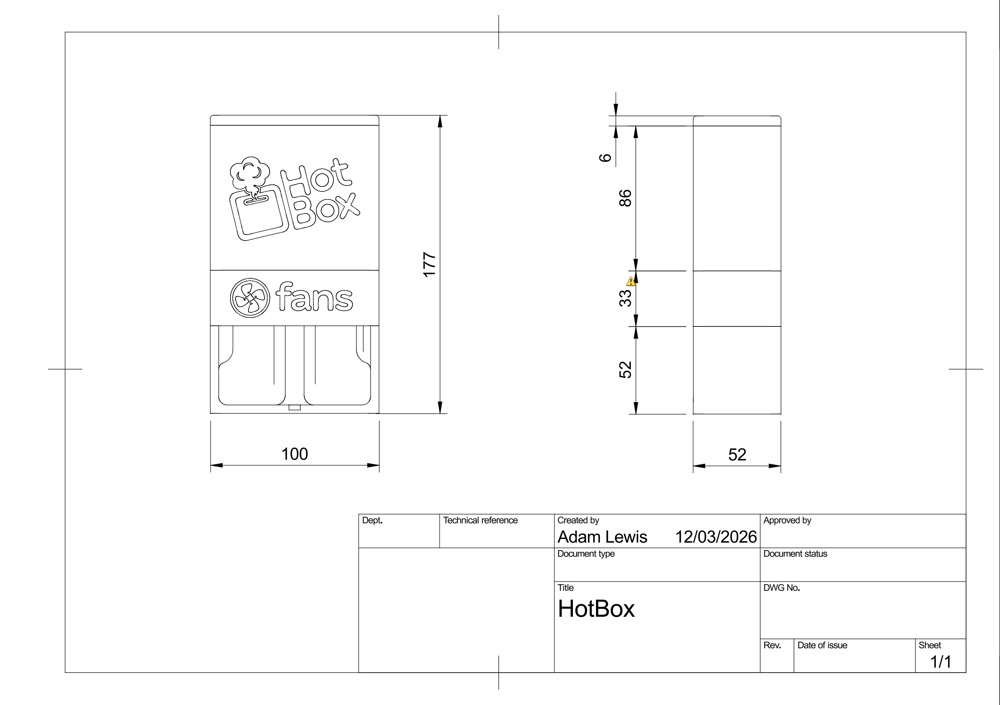</a>
</p>

# 🔥 Disclaimer 🔥

> [!WARNING]
> HotBox uses a resistive heating element inside an enclosed space. Built and configured incorrectly, it is a genuine fire risk.
>
> This project is shared as-is for experienced makers who understand the risks. The author accepts no responsibility for damage, injury, or loss of any kind. You build and run this entirely at your own risk.
>
> If you're not comfortable working with high-current DC systems and thermal management, please don't attempt this build.

# BOM

<p align="center">
<a href="assets/BOM.png"></a>
</p>

<p align="center">
<video src="assets/HotBox v18.mp4" width="50%" controls></video>
</p>

<table>
  <thead>
    <tr>
      <th>#</th>
      <th>Image</th>
      <th>Part</th>
      <th>Description</th>
      <th>Qty</th>
      <th>Notes</th>
      <th>Link</th>
    </tr>
  </thead>
  <tbody>
    <tr>
      <td>1</td>
      <td><a href="assets/BOM/PTC-heater.jpg">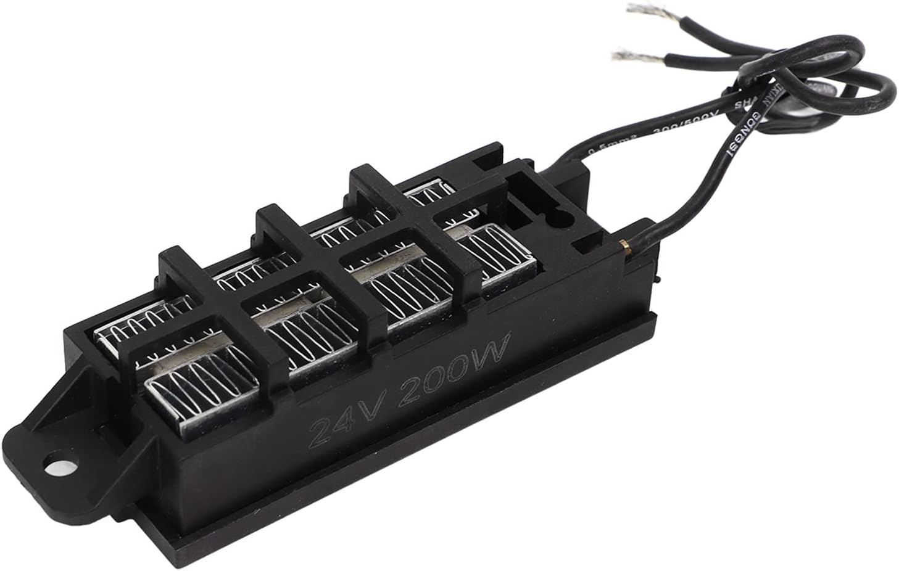</a></td>
      <td>PTC Heater Element</td>
      <td>24V 200W ceramic PTC heater</td>
      <td align="center">1</td>
      <td>Self-limiting; derate above 87°C</td>
      <td><a href="https://www.amazon.co.uk/dp/B0DK5W3RKS">amazon.co.uk</a></td>
    </tr>
    <tr>
      <td>2</td>
      <td><a href="assets/BOM/square-thermal-fuse.png">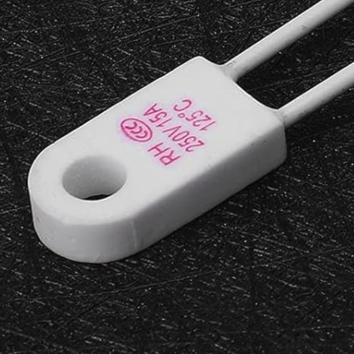</a></td>
      <td>Square Thermal Fuse</td>
      <td>125°C Ceramic Thermal 250V 15A</td>
      <td align="center">1</td>
      <td>CQC rated; soldered inline</td>
      <td><a href="https://www.amazon.co.uk/dp/B0BNQ7SJYP">amazon.co.uk</a></td>
    </tr>
    <tr>
      <td>3</td>
      <td><a href="assets/BOM/4020-fan.jpg">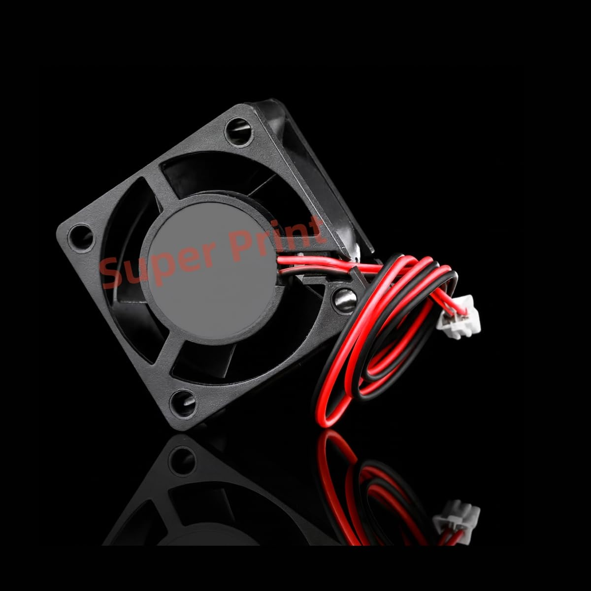</a></td>
      <td>Axial Fan</td>
      <td>24V 4020 axial fan</td>
      <td align="center">2</td>
      <td>Must run at 100% when element is powered</td>
      <td><a href="https://www.amazon.co.uk/dp/B0FRFMXKSX">amazon.co.uk</a></td>
    </tr>
    <tr>
      <td>4</td>
      <td>
        <a href="assets/BOM/NTC-100K-thermistor-OD3mm.jpg">
            
        </a>
      </td>
      <td>Thermistor</td>
      <td>NTC 100K</td>
      <td align="center">1</td>
      <td>Seats in dedicated hole in PTC body; use thermal glue</td>
      <td><a href="https://www.amazon.co.uk/dp/B0BDFHZZQX?">amazon.co.uk</a></td>
    </tr>
    <tr>
      <td>5</td>
      <td>
        <a href="assets/BOM/thermal-glue.jpg">
          
        </a>
      </td>
      <td>Thermal Glue</td>
      <td>EC360 2W/mK thermal adhesive</td>
      <td align="center">1</td>
      <td>Bonds thermistor to PTC element body</td>
      <td><a href="https://www.amazon.co.uk/dp/B00XQ9AZ8Y">amazon.co.uk</a></td>
    </tr>
    <tr>
      <td>6</td>
      <td><a href="assets/BOM/M3-SHCS-10mm.jpg">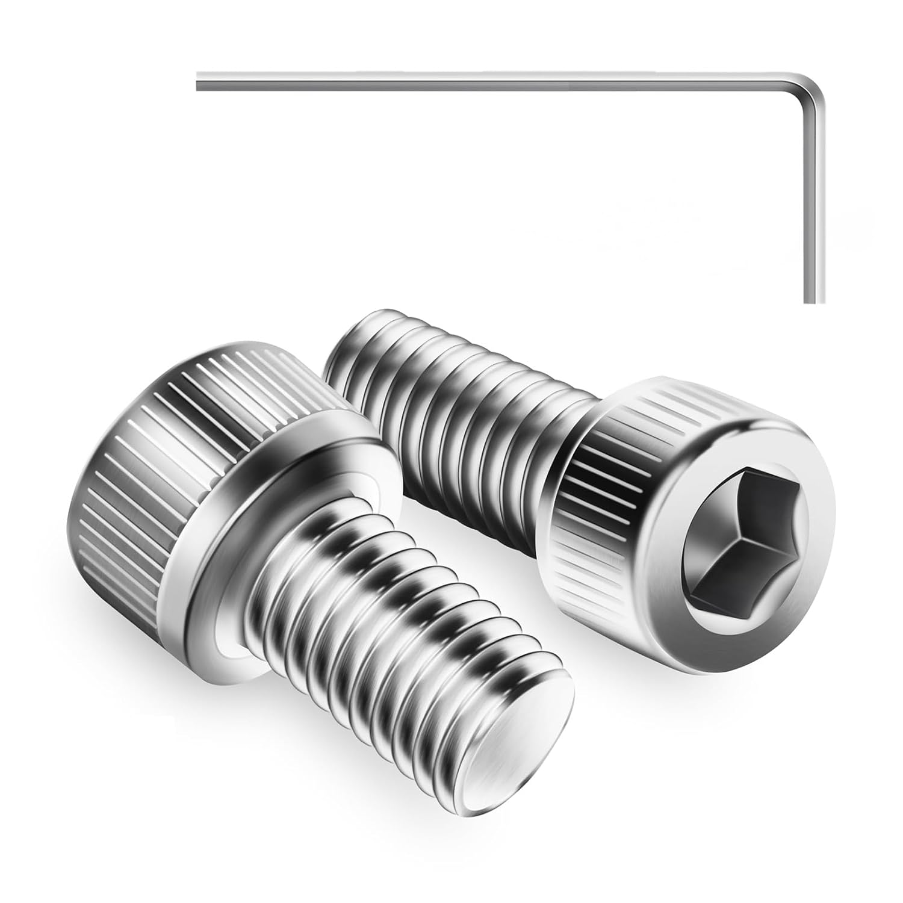</a></td>
      <td>M3×10mm SHCS</td>
      <td>Socket head cap screw</td>
      <td align="center">2</td>
      <td>Secures PTC heater element</td>
      <td></td>
    </tr>
    <tr>
      <td>7</td>
      <td><a href="assets/BOM/M3-SHCS-10mm.jpg"></a></td>
      <td>M3×25mm SHCS</td>
      <td>Socket head cap screw</td>
      <td align="center">2</td>
      <td>Heater case to fan case</td>
      <td></td>
    </tr>
    <tr>
      <td>8</td>
      <td><a href="assets/BOM/M3-SHCS-10mm.jpg"></a></td>
      <td>M3×30mm SHCS</td>
      <td>Socket head cap screw</td>
      <td align="center">4</td>
      <td>Fans through to fan duct</td>
      <td></td>
    </tr>
    <tr>
      <td>9</td>
      <td><a href="assets/BOM/heat-set-inserts.jpg">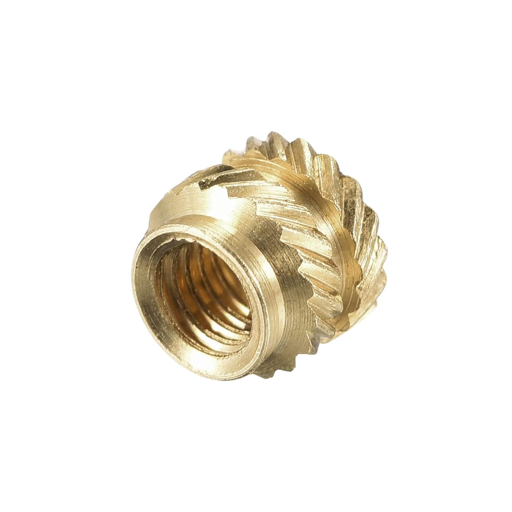</a></td>
      <td>Heat-Set Insert</td>
      <td>M3×4mm brass heat-set insert</td>
      <td align="center">8</td>
      <td></td>
      <td><a href="https://www.amazon.co.uk/dp/B0DC6RXRB9">amazon.co.uk</a></td>
    </tr>
    <tr>
      <td>10</td>
      <td><a href="assets/BOM/3x3-magnets.jpg">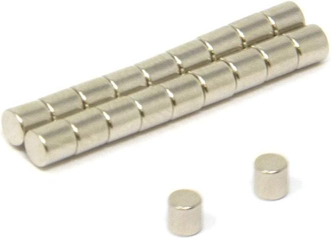</a></td>
      <td>Magnets</td>
      <td>3×3mm N42 neodymium magnets</td>
      <td align="center">8</td>
      <td>For lid retention</td>
      <td><a href="https://www.amazon.co.uk/dp/B00389GIK6">amazon.co.uk</a></td>
    </tr>
    <tr>
      <td>11</td>
      <td><a href="assets/BOM/WAGO-221-412.jpg">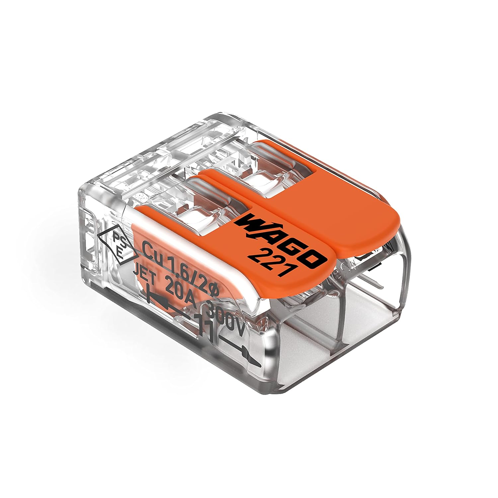</a></td>
      <td>WAGO 221-412</td>
      <td>2-conductor lever-nut splicing connector</td>
      <td align="center">3</td>
      <td>Tool-free wire connections for heater, fans and thermistor</td>
      <td><a href="https://www.amazon.co.uk/dp/B07W4RQ6R6">amazon.co.uk</a></td>
    </tr>
    <tr>
      <td>12</td>
      <td><a href="assets/BOM/lid.png">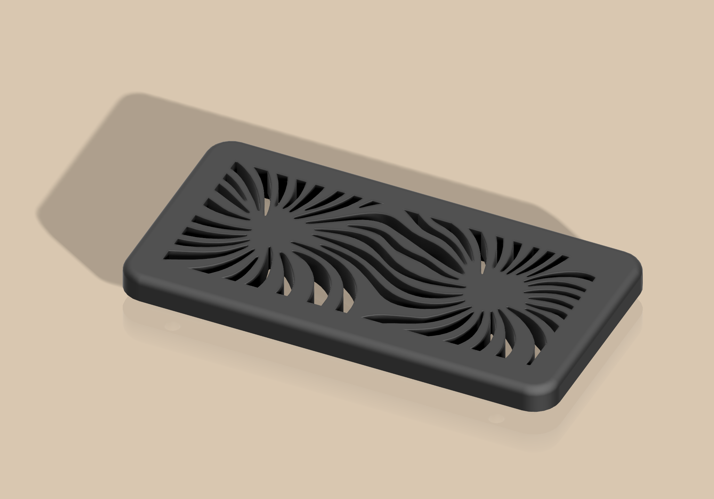</a></td>
      <td>Lid</td>
      <td>Printed part</td>
      <td align="center">1</td>
      <td>Print in ABS/ASA</td>
      <td></td>
    </tr>
    <tr>
      <td>13</td>
      <td><a href="assets/BOM/heater-case.png">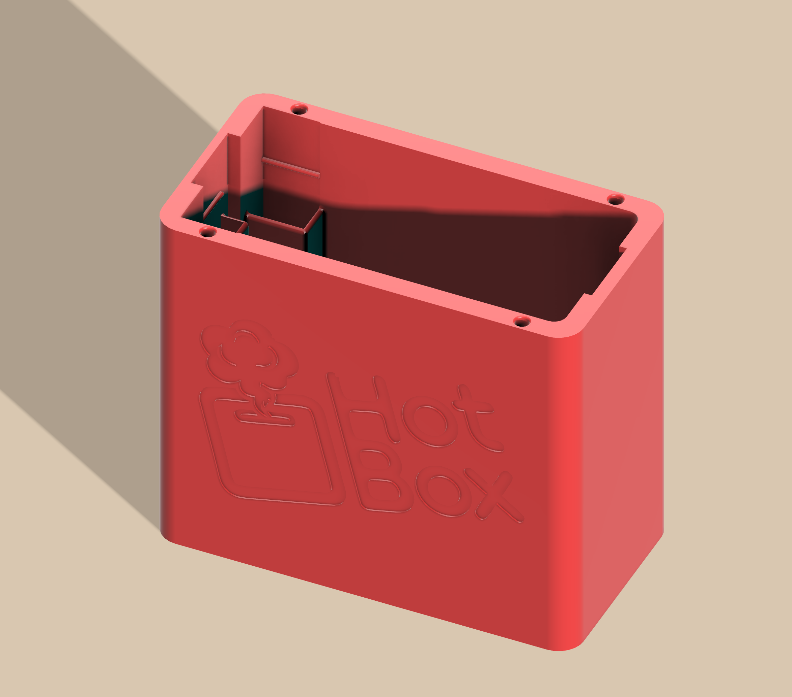</a></td>
      <td>Heater Case</td>
      <td>Printed part</td>
      <td align="center">1</td>
      <td>Print in ABS/ASA</td>
      <td></td>
    </tr>
    <tr>
      <td>14</td>
      <td><a href="assets/BOM/fan-case.png">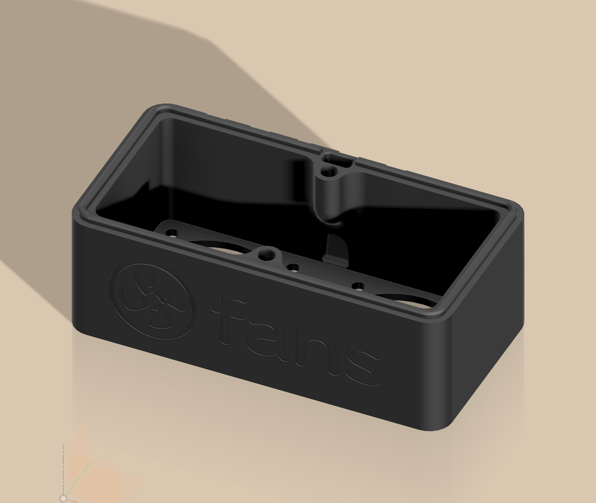</a></td>
      <td>Fan Case</td>
      <td>Printed part</td>
      <td align="center">1</td>
      <td>Print in ABS/ASA</td>
      <td></td>
    </tr>
    <tr>
      <td>15</td>
      <td><a href="assets/BOM/fan-duct.png">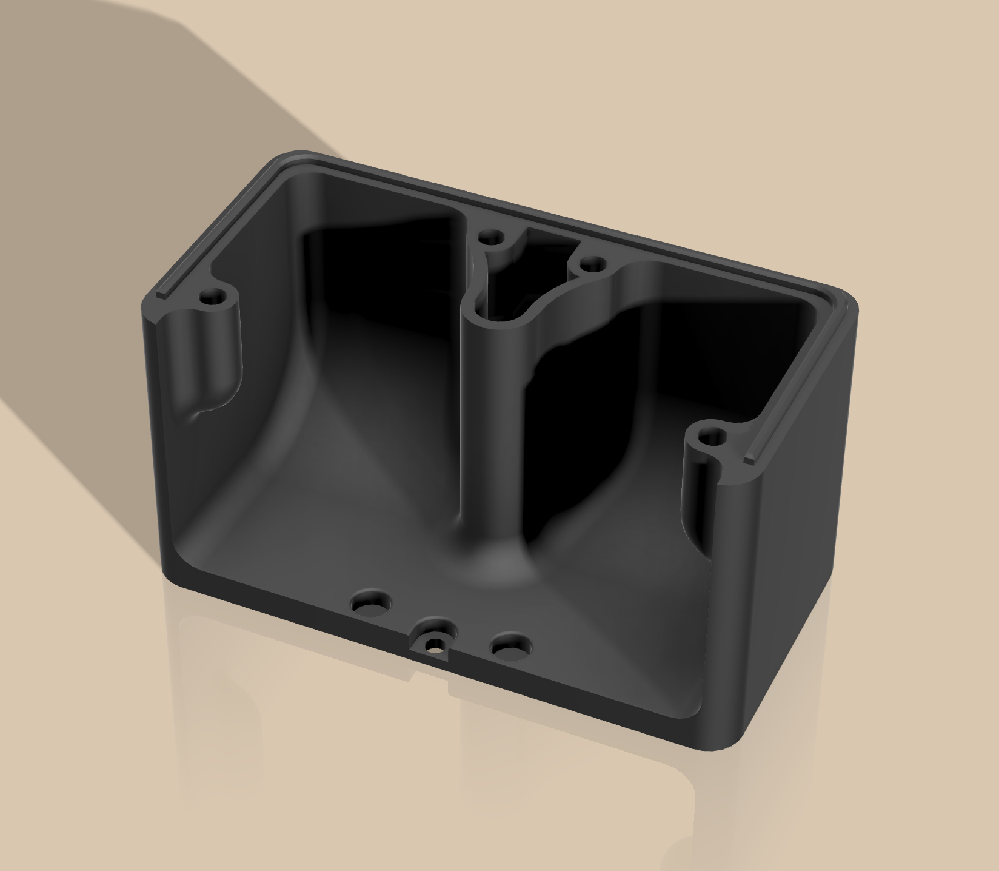</a></td>
      <td>Fan Duct</td>
      <td>Printed part</td>
      <td align="center">1</td>
      <td>Print in ABS/ASA</td>
      <td></td>
    </tr>
    <tr>
      <td>16</td>
      <td><a href="assets/BOM/zerog-fan-duct.png">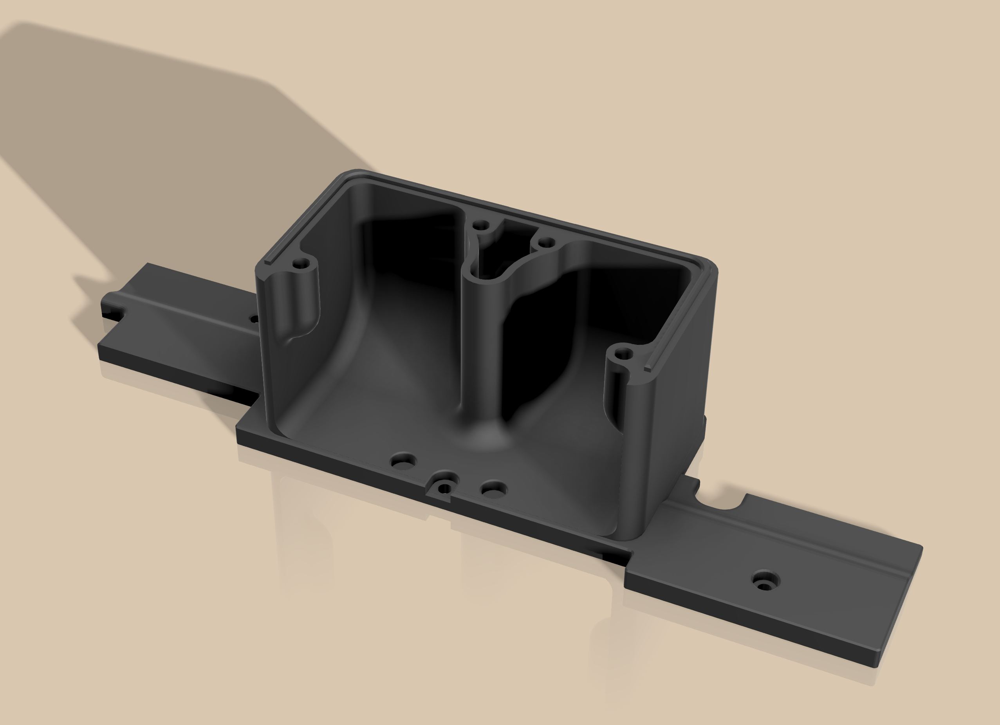</a></td>
      <td>Fan Duct ZeroG Nebula</td>
      <td>Printed part</td>
      <td align="center">1</td>
      <td>Print in ABS/ASA; alternative duct for ZeroG Nebula enclosure</td>
      <td></td>
    </tr>
  </tbody>
</table>

# Note

<p align="center">
<a href="assets/ZeroG-Nebula.png"></a>
</p>

I made this for me on my ZeroG Nebula printer. I've provided a fan duct without the filler plate which will bolt onto a 2020 extrusion, but I'm not going to try and build mounting solutions for other printers without being able to test or measure.

If you want to use this heater on your printer, either:

- Modify the fan duct, test it, let me know and it can be added to the repo
- spec out what you need and I'll build it, (untested) and publish it

# Installation instructions

(Pictures to follow soon)

## Main body

- Fit all heat-set inserts into the correct holes with a soldering iron
- Trim the ends of the thermal fuse so that the wires fit neatly into the wagos without touching the lid
- Cut one side of the PTC thermal heater wire to length so that it fits in the wag opposite the cable hole without pushing the lid
- Fill the round hole in the PTC heater with thermal glue and insert the thermistor and wait to DRY (this will not cure until up to temperature later)
- Slot the WAGO's and thermal fuse into the correct holes
- Feed the wires through the cable hole. This will be SUPER TIGHT! The hole is as large as it can be whilst maintaining the small size of the heater
- Before pulling all the wires completely through, put the wired end of the PTC heater under the thermal fuse holder and then slot in the front. Wiggle it a bit and get it into position
- Screw down the PTC heater
- Pull the wires through so that they are neat and not obstructing the heater
- Push the wires through the fan case and down through the middle hole, but do not tighten
- Put the fans in the right position in the fan case - airflow going up into the PTC element
- Feed the fan wires through the middle hole
- Feed everything through the middle hole of the fan duct (you may need to join the PTC wire to a new piece of wire and shield it)
- Screw the fan case to the fan duct
- Keeping the wires tight with one hand push it all together
- Screw the heater case to the fan case
- Use a drop of superglue in the magnet holes and tap/push/force them in with something hard

## Electronics

<p align="center">
<a href="assets/wiring-diagram.png">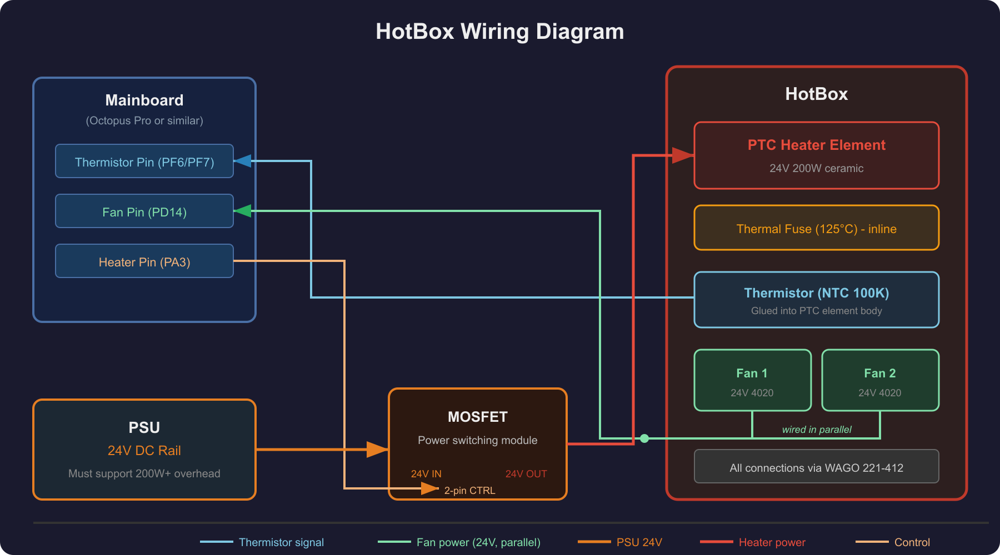</a>
</p>

This is very much dependent on your setup, but I did the following:

- Used WAGO's on the printer body to connect everything together to keep it neat
- Used a Mosfet running off the PSU and a fan PIN to modulate it
- Connected the thermistor and fans to the main board
- Configured everything in Klipper (see below)

# Klipper config

## printer.cfg

```ini
# ============================================================
# HOTBOX Config
# ============================================================

[heater_generic chamber]
heater_pin: PA3 # <---------------  change this
sensor_type: Generic 3950
sensor_pin: PF6 # <---------------  change this
min_temp: 0
max_temp: 70
control: pid
pwm_cycle_time: 0.01
pid_Kp: 100
pid_Ki: 0.3
pid_Kd: 30

[verify_heater chamber]
max_error: 600
check_gain_time: 300
hysteresis: 5
heating_gain: 0.5

# Fans will run at 100% any time the hotbox element exceeds 35, regardless
# of what Klipper is doing (PID calibration, printing, idle, anything).
[temperature_fan hotbox]
pin: PD14 # <---------------  change this
sensor_type: Generic 3950
sensor_pin: PF7 # <---------------  change this
min_temp: 0
max_temp: 120
target_temp: 35.0
min_speed: 0.0
max_speed: 1.0
control: watermark
max_delta: 1
kick_start_time: 0.5

# ============================================================
# HOTBOX CONTROL LOOP
# Runs every 5 seconds from printer startup
# Stores chamber target into HOTBOX_STATE so backoff can restart
# Fan speed is now managed automatically by [temperature_fan hotbox]
# This loop only handles: state tracking + overtemp backoff
# ============================================================
[delayed_gcode HOTBOX_CONTROL]
initial_duration: 5
gcode:
    
    
    
    
        SET_GCODE_VARIABLE MACRO=HOTBOX_STATE VARIABLE=target VALUE={chamber_target}
    
    
        SET_HEATER_TEMPERATURE HEATER=chamber TARGET=0
        UPDATE_DELAYED_GCODE ID=HOTBOX_BACKOFF DURATION=60
        RESPOND MSG="HotBox: Element at {hotbox_temp}C - 60s backoff, will restart automatically"
    
    UPDATE_DELAYED_GCODE ID=HOTBOX_CONTROL DURATION=5

# ============================================================
# HOTBOX BACKOFF TIMER
# Triggered by HOTBOX_CONTROL after element overtemp
# Calls HOTBOX_RESTART after 60 seconds
# ============================================================
[delayed_gcode HOTBOX_BACKOFF]
initial_duration: 0
gcode:
    HOTBOX_RESTART


[include hotbox_macros.cfg] # <---------------  put this with your other includes or at the end of the file

```

## hotbox_macros.cfg

```ini
# ============================================================
# hotbox_macros.cfg
# HotBox enclosure heater user macros
# Include this file from printer.cfg with [include hotbox_macros.cfg]
# ============================================================

# ============================================================
# HOTBOX_STATE
# Stores the intended chamber target so backoff can restart
# This is set both by HOTBOX_ON and by the HOTBOX_CONTROL loop
# so it works whether you use the macro or set temp directly in Mainsail
# ============================================================
[gcode_macro HOTBOX_STATE]
variable_target: 0
gcode:

# ============================================================
# HOTBOX_ON
# Usage: HOTBOX_ON TARGET=60
# Heats enclosure to target temperature (default 60C, max 70C)
# Fans start automatically via [temperature_fan hotbox] - no manual control needed
# ============================================================
[gcode_macro HOTBOX_ON]
description: Heat enclosure to target temperature. Usage: HOTBOX_ON TARGET=60
gcode:
    
    
        RESPOND MSG="HotBox: Target {TARGET}C exceeds safe maximum of 70C - aborting"
    
        RESPOND MSG="HotBox: Target {TARGET}C is too low - minimum is 30C"
    
        SET_GCODE_VARIABLE MACRO=HOTBOX_STATE VARIABLE=target VALUE={TARGET}
        SET_HEATER_TEMPERATURE HEATER=chamber TARGET={TARGET}
        UPDATE_DELAYED_GCODE ID=HOTBOX_CONTROL DURATION=5
        RESPOND MSG="HotBox: Heating enclosure to {TARGET}C - fans will run automatically"
    

# ============================================================
# HOTBOX_OFF
# Turns heater off and clears stored target
# Fans continue automatically until hotbox element cools below 40C
# ============================================================
[gcode_macro HOTBOX_OFF]
description: Turn off HotBox heater. Fans run automatically until hotbox cools below 40C
gcode:
    SET_GCODE_VARIABLE MACRO=HOTBOX_STATE VARIABLE=target VALUE=0
    SET_HEATER_TEMPERATURE HEATER=chamber TARGET=0
    RESPOND MSG="HotBox: Heater off - fans will run automatically until hotbox cools below 40C"

# ============================================================
# HOTBOX_STATUS
# Prints current hotbox status to console
# ============================================================
[gcode_macro HOTBOX_STATUS]
description: Report current HotBox temperatures and fan status
gcode:
    
    
    
    
    
    RESPOND MSG="HotBox Status:"
    RESPOND MSG="  Chamber temp: {chamber_temp}C / Target: {chamber_target}C"
    RESPOND MSG="  Hotbox element: {hotbox_temp}C"
    RESPOND MSG="  Fan speed: {(fan_speed * 100)|round}%"
    RESPOND MSG="  Stored target: {intended_target}C"

# ============================================================
# HOTBOX_RESTART
# Called automatically after 60s backoff - do not call manually
# Restarts heater using stored target if element has cooled below 75C
# ============================================================
[gcode_macro HOTBOX_RESTART]
description: Internal - restarts heater after backoff cooldown
gcode:
    
    
    
        
            SET_HEATER_TEMPERATURE HEATER=chamber TARGET={intended_target}
            RESPOND MSG="HotBox: Element cooled to {hotbox_temp}C - restarting heater to {intended_target}C"
        
            RESPOND MSG="HotBox: Element still at {hotbox_temp}C - waiting another 60s"
            UPDATE_DELAYED_GCODE ID=HOTBOX_BACKOFF DURATION=60
        
    
        RESPOND MSG="HotBox: No stored target - not restarting"
    
```

# Gotchas

- PID calibration may not work close to the enclosure's thermal limit. If the enclosure cannot reliably reach and re-reach the target temperature through multiple oscillation cycles, the calibration will fail. Try a lower target temperature (e.g. TARGET=50 instead of TARGET=60).

- PTC heater elements are self-limiting — they reduce power output as they approach their rated temperature. This makes PID calibration difficult as the element may throttle itself during the calibration oscillation cycles.

- Do NOT run PID_CALIBRATE with the fans configured as [fan_generic] controlled via delayed_gcode macros. Klipper holds the gcode queue during PID_CALIBRATE, which prevents delayed_gcode from executing, meaning fans will not run. This WILL cause the element to overheat. The fans MUST be configured as [temperature_fan] so they operate independently of the gcode queue.

- The hotbox fans must run at 100% whenever the PTC element is receiving power. This is not optional — the element will overheat and blow the thermal fuse without active cooling.

- Always let the fans cool the element down to 50 degrees or below before switching the machine off.

- There is a big thermal delay between the PTC element and the thermistor due to the distance between the two. Use thermal glue to bridge the gap, but factor this delay into any calculations.

- Running the PTC heater above 87°C for extended periods risks triggering the 125°C thermal fuse. The HOTBOX_CONTROL overtemp cutoff should be set to 87°C maximum.

- The thermistor must be seated directly in the dedicated hole in the PTC element body. Poor contact will cause it to read significantly below actual element temperature, meaning the emergency stop and overtemp cutoff will not trigger in time to protect the thermal fuse.

- The [temperature_fan] target is user-editable in Mainsail/Fluidd. Setting it above the element's safe operating temperature will prevent fans from running at the correct threshold. Do not modify this value.

- Klipper's max_temp on the [temperature_fan] section is an emergency shutdown threshold, not a cap on the settable target. Setting it too low will cause Klipper to hard-stop during normal operation.

- There needs to be enough overhead in the PSU to power a 200W PTC heater on the 24v rail, do the maths and ensure that there's enough power. If not, run an additional 200W DIN rail PSU or upgrade

- Do NOT use `control: watermark` for the chamber heater. Bang-bang switching of the heating element causes hard current transients on the shared 24V rail which affect TMC stepper driver behaviour, producing Z-axis banding artefacts on prints. Always use `control: pid` with `pwm_cycle_time: 0.01` to smooth current draw to a near-constant average.

# Shameless promotions

[Password Manager Reviews](https://passebo.com)

[VPN Reviews](https://thevpnadvisor.com)

[AI Image Generator Reviews](https://img-genius.com)

# Inspiration and credit

- [BentoBox](https://www.printables.com/model/272525-bentobox-v20-carbon-filter-for-bambu-lab-x1c-enclo) - I LOVE this and it was what triggered the idea for this design. Simple but effective in small spaces
- [BentoBox Fan Duct for ZeroG](https://www.printables.com/model/1496065-bentobox-fan-duct-for-zerog-nebula-255) - This is an absolutely great idea and I used the theory to build a similar integration for HotBox
