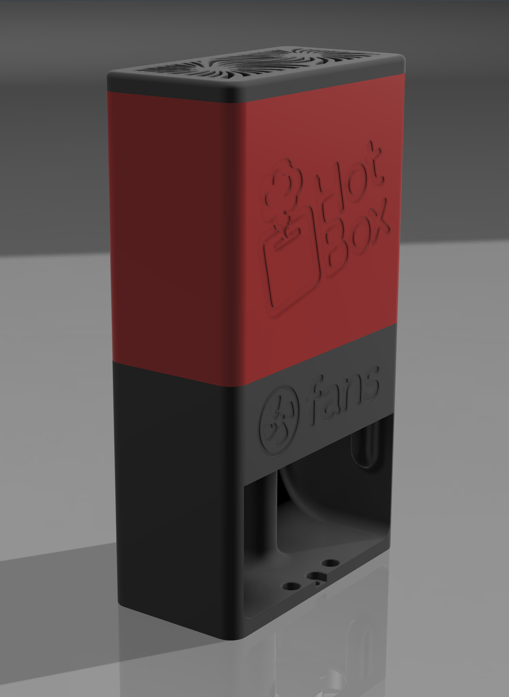
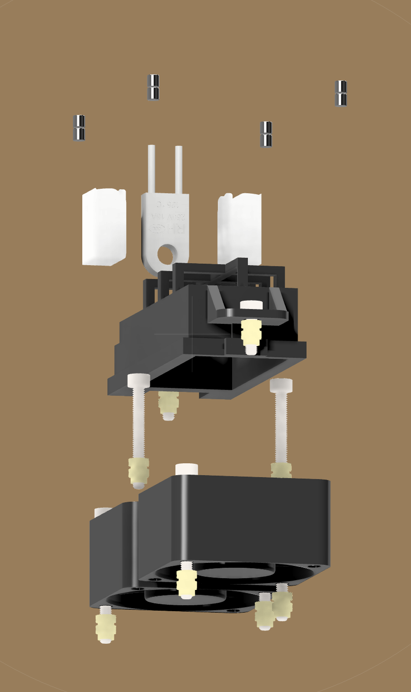
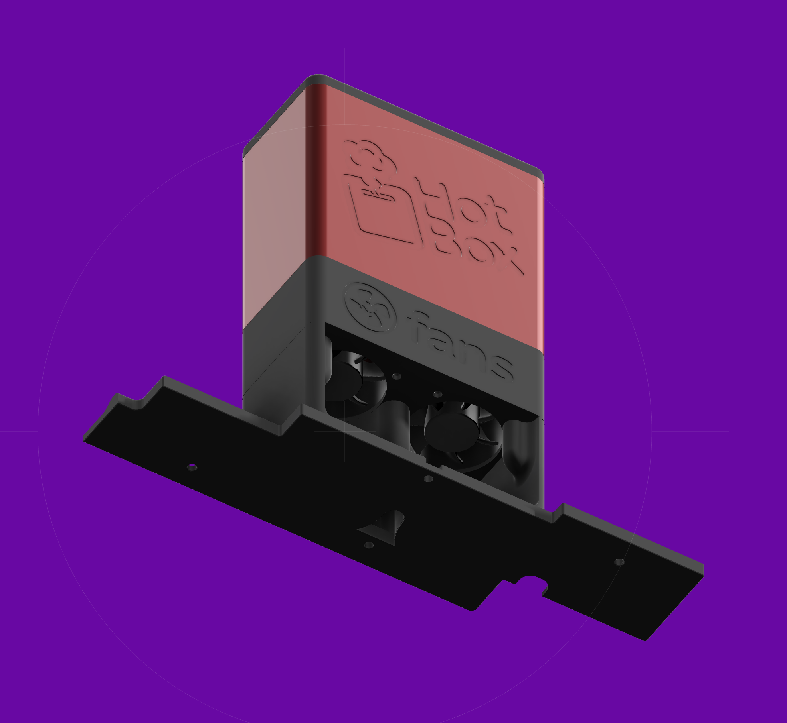

# HotBox

HotBox - a tiny enclosure heater

# 🔥 Disclaimer 🔥

HotBox uses a resistive heating element inside an enclosed space. Built and configured incorrectly, it is a genuine fire risk.

This project is shared as-is for experienced makers who understand the risks. The author accepts no responsibility for damage, injury, or loss of any kind. You build and run this entirely at your own risk.

If you're not comfortable working with high-current DC systems and thermal management, please don't attempt this build.

# BOM

# ZeroG Nebula

# Gotchas

- PID calibration may not work close to the enclosure's thermal limit. If the enclosure cannot reliably reach and re-reach the target temperature through multiple oscillation cycles, the calibration will fail. Try a lower target temperature (e.g. TARGET=50 instead of TARGET=60).

- PTC heater elements are self-limiting — they reduce power output as they approach their rated temperature. This makes PID calibration difficult as the element may throttle itself during the calibration oscillation cycles.

- Do NOT run PID_CALIBRATE with the fans configured as [fan_generic] controlled via delayed_gcode macros. Klipper holds the gcode queue during PID_CALIBRATE, which prevents delayed_gcode from executing, meaning fans will not run. This WILL cause the element to overheat. The fans MUST be configured as [temperature_fan] so they operate independently of the gcode queue.

- The hotbox fans must run at 100% whenever the PTC element is receiving power. This is not optional — the element will overheat and blow the thermal fuse without active cooling.

- Always let the fans cool the elemet down to 50 degrees or below before switching the machine off.
- There is a big thermal delay between the PTC element and the thermistor due to the distance between the two. Use thermal glue to bridge the gap, but factor this delay into any calculations
- Running the PTC heater above 87°C for extended periods risks triggering the 125°C thermal fuse. The HOTBOX_CONTROL overtemp cutoff should be set to 87°C maximum.

- The thermistor must be seated directly in the dedicated hole in the PTC element body. Poor contact will cause it to read significantly below actual element temperature, meaning the emergency stop and overtemp cutoff will not trigger in time to protect the thermal fuse.

- The [temperature_fan] target is user-editable in Mainsail/Fluidd. Setting it above the element's safe operating temperature will prevent fans from running at the correct threshold. Do not modify this value.

- Klipper's max_temp on the [temperature_fan] section is an emergency shutdown threshold, not a cap on the settable target. Setting it too low will cause Klipper to hard-stop during normal operation.

- There needs to be enough overhead in the PSU to power a 200W PTC heater on the 24v rail, do the maths and ensure that there's enough power. If not, run an additional 200W DIN rail PSU or upgrade

- Do NOT use `control: watermark` for the chamber heater. Bang-bang switching of the heating element causes hard current transients on the shared 24V rail which affect TMC stepper driver behaviour, producing Z-axis banding artefacts on prints. Always use `control: pid` with `pwm_cycle_time: 0.01` to smooth current draw to a near-constant average.
